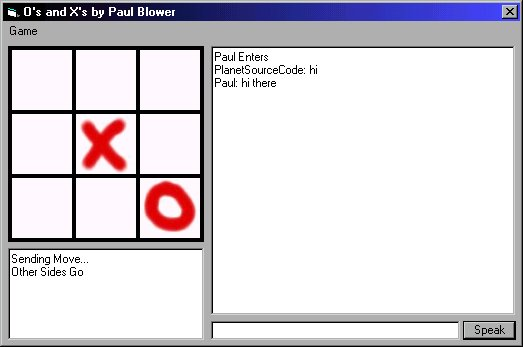



## Two Player O's and X's with Winsock

### Description

This is a 2 player game of O's and X's using winsock. It has a chat function too (see screenshot).
Its a good example of how to go about multiplayer code.

Its my first ever submission to psc, so PLEASE, please please do vote for it if you like it! - I've made a few other games like this and i'm going to post them depending on what reaction i get to this!
 
### More Info
 

             |
---                |---
**Submitted On**   |2000-08-27 18:40:16
**By**             |[Mercior](https://github.com/Planet-Source-Code/PSCIndex/blob/master/ByAuthor/mercior.md)
**Level**          |Advanced
**User Rating**    |5.0 (25 globes from 5 users)
**Compatibility**  |VB 6\.0
**Category**       |[Games](https://github.com/Planet-Source-Code/PSCIndex/blob/master/ByCategory/games__1-38.md)
**World**          |[Visual Basic](https://github.com/Planet-Source-Code/PSCIndex/blob/master/ByWorld/visual-basic.md)
**Archive File**   |[CODE\_UPLOAD93528272000\.zip](https://github.com/Planet-Source-Code/mercior-two-player-o-s-and-x-s-with-winsock__1-11032/archive/master.zip)

